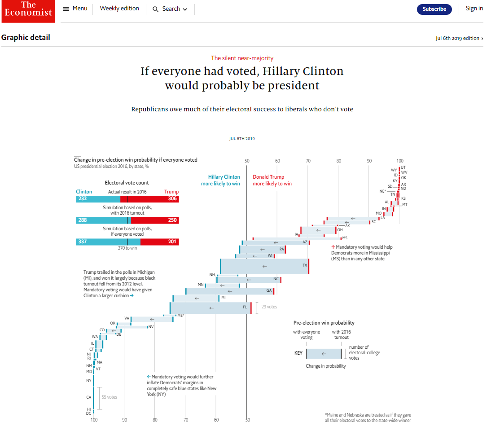

# Economist-chart-reproduction
"The Economist" magazine chart reproduction from scratch written in R Script.

Task:
1. Select a chart from "The Economist" to be reporoduced from scratch
2. Try to find similar data to build the reporoduction chart from
3. Write the R code and reproduce the chart

# Code:
https://github.com/trajceskijovan/Economist-chart-replication/blob/main/Economist_chart_replication.R

# Economist chart:
https://www.economist.com/graphic-detail/2019/07/06/if-everyone-had-voted-hillary-clinton-would-probably-be-president

# Reproduction output (png):

# Reproduction output (pdf):
https://github.com/trajceskijovan/Economist-chart-replication/blob/main/Economist-chart-replication.pdf

